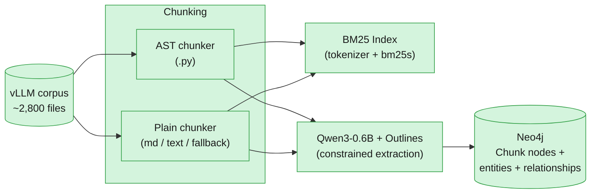

<div align="center">

# Constrained GraphRAG


**Finding the right ~2000 characters out of 28,246 chunks of the vLLM codebase via BM25.**

</div>

---

## 🧩 What is this project?

Constrained GraphRAG combines lexical-first retrieval (BM25) with **schema-constrained knowledge graph extraction** over the **vLLM 0.10.1** codebase (~2,800 files, docs + Python source).

The core idea, as a flow: each chunk is run through **Qwen3-0.6B**, constrained by [**Outlines**](https://github.com/dottxt-ai/outlines) so its output always matches a fixed schema.
1. The LLM decides which entities relate and how, Outlines just guarantees that decision comes out structurally valid.
2. Extracted entities and relationships are loaded into **Neo4j** as a graph, connecting chunks through the entities they share.
3. BM25 search at query time, BM25 finds the chunks that lexically match.
4. Graph traversal: the graph is traversed outward from them to pull in related chunks that never shared a single term with the original match.

Mechanics of *how* the constraining actually works are in [Extraction](#-extraction--constrained-decoding) below.

**Why this over a naive lexical-only RAG** (the shape of a prior BM25-only project): plain lexical retrieval has no concept of "entity" at all, only term frequency — a chunk mentioning `"Acme Corp"` and a chunk mentioning `"Acme Corporation"` share almost no tokens, and no amount of BM25 tuning can ever connect them, because the retriever has nothing to connect *with*. GraphRAG's answer is entity resolution: once both surface forms are merged into one canonical graph node at load time, *every* chunk mentioning either form becomes reachable from *every other* chunk mentioning either form, through that shared node.

A corpus is chunked into focused, offset-tracked spans, indexed with BM25 over an identifier-aware tokenizer, and searchable from a CLI — no embeddings, no vector index, no LLM in the loop yet.

```
uv run python -m src search "enable lora" --k 5
```

```
1. data/raw/vllm-0.10.1/tests/lora/test_tokenizer_group.py [2141:2747] score=5.07
2. data/raw/vllm-0.10.1/tests/lora/test_llama_tp.py [8720:9022] score=4.78
3. data/raw/vllm-0.10.1/vllm/transformers_utils/tokenizer_group.py [691:1287] score=4.74
```

---

## 🏗 Architecture

**Offline — building the graph** (`pipeline/index_pipeline.py`):



**Online — answering a query** (`pipeline/query_pipeline.py`):


🟢 built and tested · ⬜ dashed = designed, not yet built (extraction, graph, query pipeline)

---

## 🔄 Workflow

 The two diagrams above show data flowing between modules, this is the actual division of labor behind that flow, offline and online pieces both:

**The corpus is chunked (`chunking/`) → each chunk runs through `extractor.py`, where the LM creates entity-relationships *within* that one chunk → `loader.py`'s `MERGE` incidentally connects *across* chunks by reusing shared entity names → *(at query time)* BM25 (`retrieval/lexical/`) finds lexically-matching seed chunks → `traversal.py`'s `MATCH` *reads* the already-existing connections, expanding outward from those seeds to pull in chunks BM25 never lexically matched.**


---

## 🔗 Built On

Two earlier projects each contributed one core technique reused here, adapted rather than copied wholesale:

- **[RAG Against the Machine](https://github.com/DimYiannis/RAG-Against-the-Machine)** — the BM25 lexical retriever. `retrieval/lexical/tokenizer.py` and `indexer.py` are a direct port of that project's identifier-aware tokenizer and `bm25s`-backed index, adapted to this project's chunk metadata and package layout.
- **[call me maybe](https://github.com/DimYiannis/call_me_maybe)** — a function-calling engine that constrains a Qwen3-0.6B model's output token-by-token via a hand-rolled state machine over the model's vocabulary, so it can only ever emit valid, schema-conforming JSON. That project's core idea — grammar-constrained decoding making a 0.6B model reliable for structured generation — is exactly the mechanism `extraction/schema.py` is designed around here, this time via the [Outlines](https://github.com/dottxt-ai/outlines) library instead of a hand-rolled decoder.

---

## 🗂 Project Structure

```
constrained-graphrag/
├── src/
│   ├── __main__.py               # Fire CLI — index, search
│   ├── chunking/
│   │   ├── chunk_corpus.py       # corpus walking, file dispatch by extension
│   │   ├── ast_chunker.py        # AST-based chunking for .py (function/class-level)
│   │   ├── plain_chunker.py      # header-based chunking for markdown, line fallback
│   │   └── spans.py              # shared span-splitting + Chunk dataclass
│   ├── retrieval/
│   │   └── lexical/
│   │       ├── tokenizer.py      # identifier-aware tokenizer (subtokens, stopwords)
│   │       └── indexer.py        # Index build/save/load, top-k search (bm25s-backed)
│   ├── extraction/
│   │   ├── schema.py             # node/relationship types, the Outlines grammar source
│   │   ├── extractor.py          # runs Qwen3-0.6B + Outlines, one chunk in, triples out
│   │   └── prompts/
│   │       ├── code_prompt.py    # extraction prompt for code chunks
│   │       └── text_prompt.py    # extraction prompt for text/config chunks
│   ├── graph/
│   │   ├── neo4j_client.py       # connection handling
│   │   ├── loader.py             # writes one chunk's triples into Neo4j
│   │   └── traversal.py          # graph expansion outward from BM25's results
│   ├── pipeline/           
│   │   ├── index_pipeline.py
│   │   └── query_pipeline.py
│   └── cache/                   
│       └── cache.py
├── data/                          
├── pyproject.toml
├── uv.lock
└── README.md
```

Click a folder, then click a file inside it, to see what it does:

<details>
<summary>📁 <strong>src/</strong></summary>

<details>
<summary>📄 <code>__main__.py</code></summary>

The CLI entry point. Fire turns each method on `RagCLI` into a command — `index` chunks a corpus and builds the BM25 index, `search` queries it and prints ranked results.

</details>

</details>

<details>
<summary>📁 <strong>src/chunking/</strong></summary>

<details>
<summary>📄 <code>chunk_corpus.py</code></summary>

Walks a corpus directory, decides each file's chunking strategy and `source_type` ("code" vs "text") by extension, dispatches to the right chunker below.

</details>

<details>
<summary>📄 <code>ast_chunker.py</code></summary>

Chunks Python files by parsing the AST; each top-level function/class becomes its own chunk, decorators included. Falls back to line-window chunking if a file fails to parse.

</details>

<details>
<summary>📄 <code>plain_chunker.py</code></summary>

Chunks markdown by ATX headers (each `#`…`######` starts a new section), everything else by a fixed line-window fallback.

</details>

<details>
<summary>📄 <code>spans.py</code></summary>

The `Chunk` dataclass, and the shared span-splitting logic (cuts at a blank line, then any newline, then mid-line) every chunker funnels through to enforce `max_chunk_size`.

</details>

</details>

<details>
<summary>📁 <strong>src/retrieval/lexical/</strong></summary>

<details>
<summary>📄 <code>tokenizer.py</code></summary>

Turns text into BM25 search terms: lowercases, and splits identifiers into both whole and subtoken forms (`enable_lora` → `enable_lora`, `enable`, `lora`) so a query can match either way.

</details>

<details>
<summary>📄 <code>indexer.py</code></summary>

Builds/saves/loads the BM25 index (backed by `bm25s`), and `search()` — turns a query into ranked, tie-broken chunk results.

</details>

</details>

<details>
<summary>📁 <strong>src/extraction/</strong></summary>

<details>
<summary>📄 <code>schema.py</code></summary>

The fixed vocabulary of node/relationship types, and the Pydantic model (`ExtractionResult`) handed directly to Outlines — this file *is* the grammar the model's output gets constrained against, not just documentation of it.

</details>

<details>
<summary>📄 <code>extractor.py</code></summary>

Loads Qwen3-0.6B through Outlines, builds a reusable constrained generator, runs it on one chunk at a time: text in, a validated `ExtractionResult` (entities + relationships) out. The model never sees more than one chunk at once.

</details>

<details>
<summary>📄 <code>prompts/code_prompt.py</code> / <code>text_prompt.py</code></summary>

The two extraction prompts, routed by a chunk's `source_type`. Outlines guarantees the model's output is *structurally* valid; these prompts are what steer it toward *semantically* sensible choices within that structure.

</details>

</details>

<details>
<summary>📁 <strong>src/graph/</strong></summary>

<details>
<summary>📄 <code>neo4j_client.py</code></summary>

Connection handling: builds a driver from `NEO4J_URI`/`NEO4J_USER`/`NEO4J_PASSWORD` (env vars, never hardcoded), verifies it can actually reach the database, a thin wrapper for running a Cypher query.

</details>

<details>
<summary>📄 <code>loader.py</code></summary>

Writes one chunk's `ExtractionResult` into Neo4j: the `Chunk` node, each entity (merged by name+type, which is what lets the same entity mentioned in different chunks become one shared node), the `MENTIONED_IN` edges linking entities back to their chunk, and the extracted relationship edges between entities.

</details>

<details>
<summary>📄 <code>traversal.py</code></summary>

Takes BM25's top-k results as seed chunks, walks 1-2 hops outward through the graph from the entities mentioned in them, returns the *other* chunks reachable that way — chunks BM25 never lexically matched at all.

</details>

</details>

<details>
<summary>📁 <strong>src/pipeline/</strong> and <strong>src/cache/</strong></summary>

<details>
<summary>📄 <code>index_pipeline.py</code>, <code>query_pipeline.py</code>, <code>cache.py</code></summary>

Empty placeholder files, not built yet. `pipeline/` will orchestrate everything above into an actual offline indexing run and a runtime query flow; `cache/` will hold a reused caching layer.

</details>

</details>

<details>
<summary>📁 <strong>data/</strong></summary>

<details>
<summary>📄 <code>raw/&lt;corpus-name&gt;/</code></summary>

Holds the corpus. Gitignored — nothing under it is committed, and no path is hard-coded anywhere in the project; every input/output location is a CLI argument.

</details>

</details>

---

## 🧠 Extraction & Constrained Decoding

The extraction schema (`extraction/schema.py`) is a Pydantic model (`ExtractionResult`) handed directly to Outlines. Outlines compiles that schema into a **finite state machine**, and at every single token the model generates, masks every token that would leave a valid path through that FSM down to probability zero before sampling — a **mathematical guarantee**, not a "the model was told to behave" guarantee. That's what makes a 0.6B model viable here at all: the reliability gap that would normally require a frontier model is closed by making invalid output structurally unreachable, rather than by making the model smarter.

Two things worth being precise about scope-wise:

- This constrains *structure and type* (`node_type`/`relation` are enum-restricted fields, `name`/`subject`/`target` are regex-restricted to an identifier shape) — it does **not** constrain *which* real-world thing a name refers to. Two chunks extracting the same real entity under different names (`"Acme Corp"` vs `"Acme Corporation"`) is a separate problem, solved (once built) by entity resolution in `graph/loader.py` at load time, not by constrained decoding.
- `CHUNK` and `MENTIONED_IN` are deliberately excluded from what the model is even allowed to emit (see `ExtractableNodeType`/`ExtractableRelationType` in `schema.py`) — `Chunk` nodes already exist before extraction runs, and `MENTIONED_IN` is structural (an entity extracted *from* a chunk is trivially mentioned in it), added automatically rather than spending the model's constrained generation budget on it.

---

## 🏷 Closed Taxonomy vs. Open Labeling

**Designing a closed relation-type taxonomy, instead of open-ended extraction.** The default approach in most GraphRAG tutorials is to let the model freely choose relationship labels from context — `"calls"`, `"invokes"`, `"is called by"`, `"depends on"`. At small scale this looks harmless. At the scale needed for a usable knowledge graph, it becomes label proliferation: dozens of near-duplicate relation strings fragmenting what should be one queryable edge type, with no clean way back — post-hoc clustering/deduplication is lossy and adds a whole extra, failure-prone pipeline stage. The alternative, restricting up front, risks losing genuinely useful nuance if the schema is too coarse. Resolved by defining a small, fixed enum of relation types (`CALLS`, `IMPORTS`, `INHERITS_FROM`, `RELATES_TO`, etc. — see `RelationType` in `schema.py`) and enforcing them at generation time via the same FSM-based constrained decoding used throughout this project: the model is only ever able to emit a token sequence resolving to one of the valid types, trading some expressiveness for guaranteed schema consistency. The right tradeoff for a system meant to support reliable multi-hop traversal, less so for open-ended exploratory tagging.

*What I'd do differently:* design the enum with an explicit versioning/extension process from the start, rather than treating it as fixed. A closed schema solves label proliferation, but a genuinely new relationship type the initial design didn't anticipate has nowhere to go except a catch-all like `RELATES_TO` — which just relocates the fuzziness instead of removing it. Better: periodically review catch-all usage as a signal for when the enum itself needs a deliberate, reviewed addition — schema evolution as a governed process, not a binary choice between fully open and fully frozen.

---

## 🧗 Challenges Faced

**A 0.6B model doesn't automatically produce clean, real identifiers just because the JSON around them is valid.** Early testing surfaced two distinct failure modes, fixed at two different layers:

- **Prompt-level fix:** the model would sometimes name an entity after the schema's own type vocabulary — literally `"Function"`, `"Class"`, `"Module"` as an entity's *name*, copying the words right next to where `name` was being defined in the prompt. Fixed by extending both extraction prompts (`code_prompt.py`/`text_prompt.py`) with an explicit worked example and a direct instruction: the name is a real identifier from the text, never the literal type-vocabulary words.
- **Schema-level fix:** relationship `subject`/`target` values kept showing up as entire import statements or sentences instead of clean identifiers — structurally valid per the schema at the time (a plain unconstrained `str`), but semantically useless. Prompt wording alone only partially fixed this. The real fix was adding a regex constraint (`Field(pattern=r"^[A-Za-z_][A-Za-z0-9_.]*$")`) directly to `schema.py`'s `name`/`subject`/`target` fields — Outlines compiles that pattern into the same FSM that already enforces `node_type`/`relation`, so a full import statement became *structurally unreachable* to generate, not just discouraged by prompt text.

**One edge case the regex fix doesn't close:** it constrains *shape*, not *truth*. The model can still fabricate a string that looks identifier-shaped but isn't a real symbol anywhere in the source — observed case: `from vllm.utils import LRUCache` got mashed into `"from_vllm.utils.lrucache"` as a relationship target, which satisfies the regex (only letters/underscores/dots) while being a fabrication. A regex can only ever constrain what a string *looks like*; verifying it's a *real* symbol from the actual chunk would need a fundamentally different mechanism.

---

## 📎 Resources

- [graphrag.com](https://graphrag.com/) — general GraphRAG background.
- [The GraphRAG Manifesto — Neo4j](https://neo4j.com/blog/genai/graphrag-manifesto/) — why graph-augmented retrieval beats naive RAG.
- [Cypher `MERGE` clause](https://neo4j.com/docs/cypher-manual/current/clauses/merge/) — idempotent node/relationship creation, used throughout `graph/loader.py`.
- [Knowledge Graphs for RAG — DeepLearning.AI](https://www.deeplearning.ai/courses/knowledge-graphs-rag) — course on building/querying knowledge graphs for RAG.
- Robertson & Zaramba, *The Probabilistic Relevance Framework: BM25 and Beyond* — BM25 scoring, `k1`/`b`.
- [bm25s documentation](https://github.com/xhluca/bm25s) — the BM25 library used here.
- [Python `ast` module docs](https://docs.python.org/3/library/ast.html) — used for structure-aware Python chunking.
- [uv docs](https://docs.astral.sh/uv/) — dependency/project management.
- [How to Build Type-Safe, Schema-Constrained, and Function-Driven LLM Pipelines Using Outlines and Pydantic](https://www.marktechpost.com/2026/03/14/how-to-build-type-safe-schema-constrained-and-function-driven-llm-pipelines-using-outlines-and-pydantic/) — Outlines + Pydantic structured generation.
- [Structured Output (JSON) — LoRAX Docs](https://loraexchange.ai/guides/structured_output/) — constrained JSON generation background.
- [Outlines — structured JSON/regex/Pydantic LLM generation](https://hermes-agent.nousresearch.com/docs/user-guide/skills/optional/mlops/mlops-inference-outlines) — how Outlines' FSM-based constraining works.
- [Outlines Model Initialization](https://dottxt-ai.github.io/outlines/main/features/models/transformers/?utm_source=chatgpt.com)
- [Loading models from HF](https://huggingface.co/docs/transformers/en/models?utm_source=chatgpt.com)
- [Tokenizer and Auto classes from HF](https://huggingface.co/docs/transformers/model_doc/auto?utm_source=chatgpt.com)
- [Outlines Generator](https://dottxt-ai.github.io/outlines/main/features/core/generator/?utm_source=chatgpt.com)
