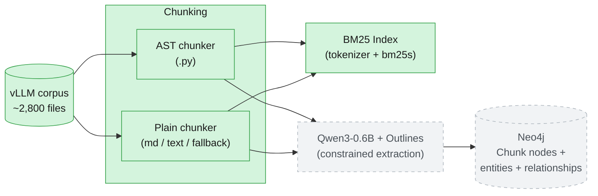
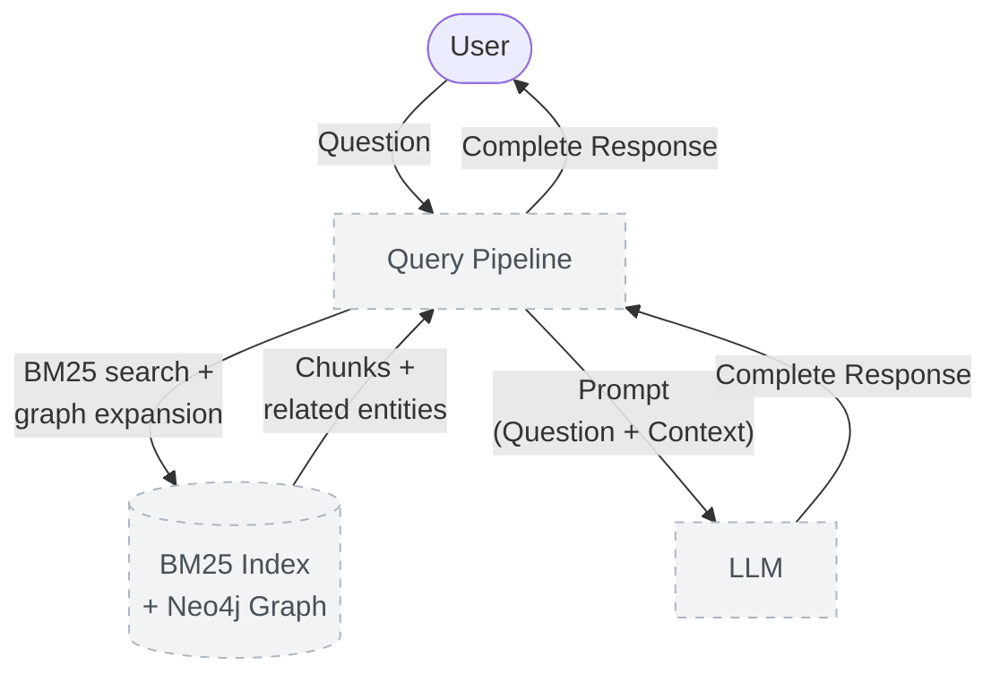

<div align="center">

# Constrained GraphRAG


**Finding the right ~2000 characters out of 28,246 chunks of the vLLM codebase via BM25.**

</div>

---

## 🧩 What is this project?

Constrained GraphRAG combines lexical-first retrieval (BM25) with **schema-constrained knowledge graph extraction** over the **vLLM 0.10.1** codebase (~2,800 files, docs + Python source).

The core idea, as a flow: each chunk is run through **Qwen3-0.6B**, constrained by [**Outlines**](https://github.com/dottxt-ai/outlines) so its output always matches a fixed schema — the LLM decides which entities relate and how, Outlines just guarantees that decision comes out structurally valid → those extracted entities and relationships are loaded into **Neo4j** as a graph, connecting chunks through the entities they share → at query time, BM25 finds the chunks that lexically match, then the graph is traversed outward from them to pull in related chunks that never shared a single term with the original match. Mechanics of *how* the constraining actually works are in [Extraction](#-extraction--constrained-decoding) below.

**Why this over a naive lexical-only RAG** (the shape of a prior BM25-only project): plain lexical retrieval has no concept of "entity" at all, only term frequency — a chunk mentioning `"Acme Corp"` and a chunk mentioning `"Acme Corporation"` share almost no tokens, and no amount of BM25 tuning can ever connect them, because the retriever has nothing to connect *with*. GraphRAG's answer is entity resolution: once both surface forms are merged into one canonical graph node at load time, *every* chunk mentioning either form becomes reachable from *every other* chunk mentioning either form, through that shared node.

A corpus is chunked into focused, offset-tracked spans, indexed with BM25 over an identifier-aware tokenizer, and searchable from a CLI — no embeddings, no vector index, no LLM in the loop yet.

```
uv run python -m src search "enable lora" --k 5
```

```
1. data/raw/vllm-0.10.1/tests/lora/test_tokenizer_group.py [2141:2747] score=5.07
2. data/raw/vllm-0.10.1/tests/lora/test_llama_tp.py [8720:9022] score=4.78
3. data/raw/vllm-0.10.1/vllm/transformers_utils/tokenizer_group.py [691:1287] score=4.74
```

---

## 🏗 Architecture

**Offline — building the graph** (`pipeline/index_pipeline.py`):



**Online — answering a query** (`pipeline/query_pipeline.py`):



🟢 built and tested · ⬜ dashed = designed, not yet built (extraction, graph, query pipeline)

---

## 🔗 Built On

Two earlier projects each contributed one core technique reused here, adapted rather than copied wholesale:

- **[RAG Against the Machine](https://github.com/DimYiannis/RAG-Against-the-Machine)** — the BM25 lexical retriever. `retrieval/lexical/tokenizer.py` and `indexer.py` are a direct port of that project's identifier-aware tokenizer and `bm25s`-backed index, adapted to this project's chunk metadata and package layout.
- **[call me maybe](https://github.com/DimYiannis/call_me_maybe)** — a function-calling engine that constrains a Qwen3-0.6B model's output token-by-token via a hand-rolled state machine over the model's vocabulary, so it can only ever emit valid, schema-conforming JSON. That project's core idea — grammar-constrained decoding making a 0.6B model reliable for structured generation — is exactly the mechanism `extraction/schema.py` is designed around here, this time via the [Outlines](https://github.com/dottxt-ai/outlines) library instead of a hand-rolled decoder.

---

## 🗂 Project Structure

```
constrained-graphrag/
├── src/
│   ├── __main__.py             # Fire CLI — index, search
│   ├── chunking/
│   │   ├── chunk_corpus.py     # corpus walking, file dispatch by extension
│   │   ├── ast_chunker.py      # AST-based chunking for .py (function/class-level)
│   │   ├── plain_chunker.py    # header-based chunking for markdown, line fallback
│   │   └── spans.py            # shared span-splitting + Chunk dataclass
│   └── retrieval/
│       └── lexical/
│           ├── tokenizer.py    # identifier-aware tokenizer (subtokens, stopwords)
│           └── indexer.py      # Index build/save/load, top-k search (bm25s-backed)
├── data/                        # gitignored, populated locally, never committed
├── pyproject.toml
├── uv.lock
└── README.md
```

Click a folder to see what's inside it:

<details>
<summary>📁 <strong>src/</strong></summary>

The CLI entry point (`__main__.py`, Fire-based) plus every module the pipeline is built from so far — chunking and lexical retrieval.

</details>

<details>
<summary>📁 <strong>src/chunking/</strong></summary>

Structure-aware chunkers with exact character offsets: AST-based splitting for Python (function/class-level), header-based sectioning for markdown, and a line-window fallback for everything else. Every produced span passes through a shared cap-enforcing splitter so no chunk exceeds `max_chunk_size`.

</details>

<details>
<summary>📁 <strong>src/retrieval/lexical/</strong></summary>

BM25 retrieval: an identifier-aware tokenizer (splits `enable_lora` into whole and subtoken forms), and the index build/persist/search logic backed by `bm25s`.

</details>

<details>
<summary>📁 <strong>data/</strong></summary>

Holds the corpus, under `data/raw/<corpus-name>/`. Gitignored — nothing under it is committed, and no path is hard-coded anywhere in the project; every input/output location is a CLI argument.

</details>

---

## 🧠 Extraction & Constrained Decoding

The extraction schema (`extraction/schema.py`) is a Pydantic model (`ExtractionResult`) handed directly to Outlines. Outlines compiles that schema into a **finite state machine**, and at every single token the model generates, masks every token that would leave a valid path through that FSM down to probability zero before sampling — a **mathematical guarantee**, not a "the model was told to behave" guarantee. That's what makes a 0.6B model viable here at all: the reliability gap that would normally require a frontier model is closed by making invalid output structurally unreachable, rather than by making the model smarter.

Two things worth being precise about scope-wise:

- This constrains *structure and type* (`node_type`/`relation` are enum-restricted fields) — it does **not** constrain entity *names*, which are free text. Two chunks extracting the same real entity under different names (`"Acme Corp"` vs `"Acme Corporation"`) is a separate problem, solved (once built) by entity resolution in `graph/loader.py` at load time, not by constrained decoding.
- `CHUNK` and `MENTIONED_IN` are deliberately excluded from what the model is even allowed to emit (see `ExtractableNodeType`/`ExtractableRelationType` in `schema.py`) — `Chunk` nodes already exist before extraction runs, and `MENTIONED_IN` is structural (an entity extracted *from* a chunk is trivially mentioned in it), added automatically rather than spending the model's constrained generation budget on it.

---

## 📎 Resources

- [graphrag.com](https://graphrag.com/) — general GraphRAG background.
- [The GraphRAG Manifesto — Neo4j](https://neo4j.com/blog/genai/graphrag-manifesto/) — why graph-augmented retrieval beats naive RAG.
- [Knowledge Graphs for RAG — DeepLearning.AI](https://www.deeplearning.ai/courses/knowledge-graphs-rag) — course on building/querying knowledge graphs for RAG.
- Robertson & Zaramba, *The Probabilistic Relevance Framework: BM25 and Beyond* — BM25 scoring, `k1`/`b`.
- [bm25s documentation](https://github.com/xhluca/bm25s) — the BM25 library used here.
- [Python `ast` module docs](https://docs.python.org/3/library/ast.html) — used for structure-aware Python chunking.
- [uv docs](https://docs.astral.sh/uv/) — dependency/project management.
- [How to Build Type-Safe, Schema-Constrained, and Function-Driven LLM Pipelines Using Outlines and Pydantic](https://www.marktechpost.com/2026/03/14/how-to-build-type-safe-schema-constrained-and-function-driven-llm-pipelines-using-outlines-and-pydantic/) — Outlines + Pydantic structured generation.
- [Structured Output (JSON) — LoRAX Docs](https://loraexchange.ai/guides/structured_output/) — constrained JSON generation background.
- [Outlines — structured JSON/regex/Pydantic LLM generation](https://hermes-agent.nousresearch.com/docs/user-guide/skills/optional/mlops/mlops-inference-outlines) — how Outlines' FSM-based constraining works.
- [Outlines Model Initialization](https://dottxt-ai.github.io/outlines/main/features/models/transformers/?utm_source=chatgpt.com)
- [Loading models from HF](https://huggingface.co/docs/transformers/en/models?utm_source=chatgpt.com)
- [Tokenizer and Auto classes from HF](https://huggingface.co/docs/transformers/model_doc/auto?utm_source=chatgpt.com)
- [Outlines Generator](https://dottxt-ai.github.io/outlines/main/features/core/generator/?utm_source=chatgpt.com)
