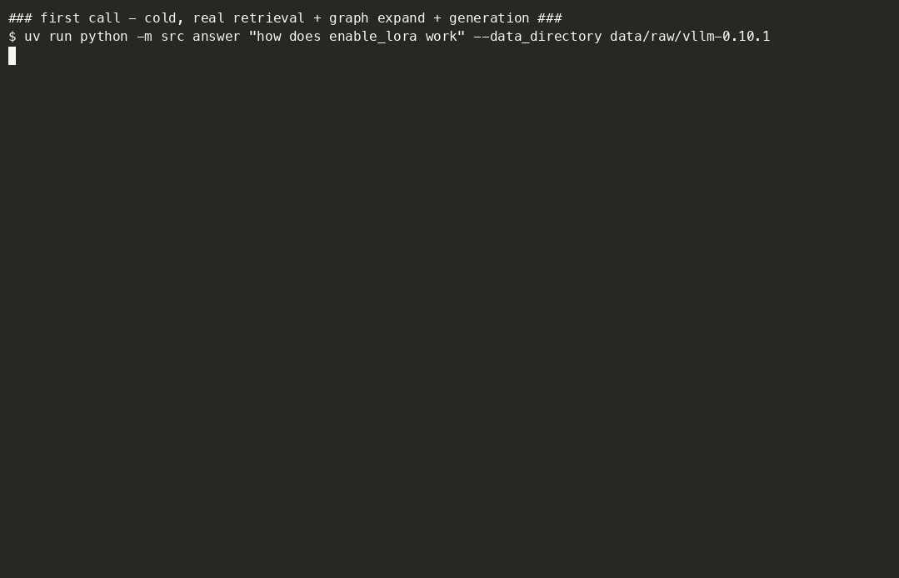
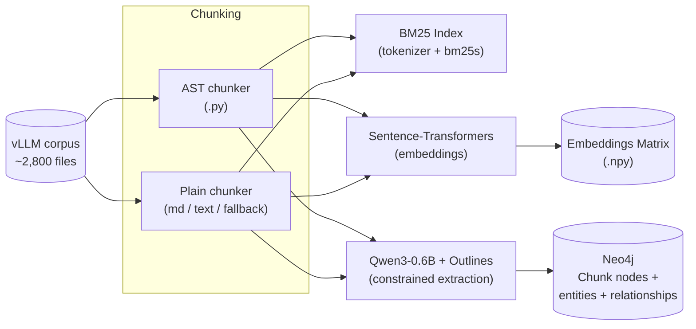
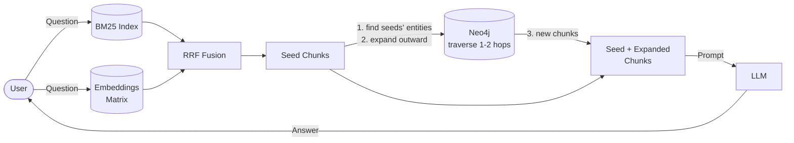
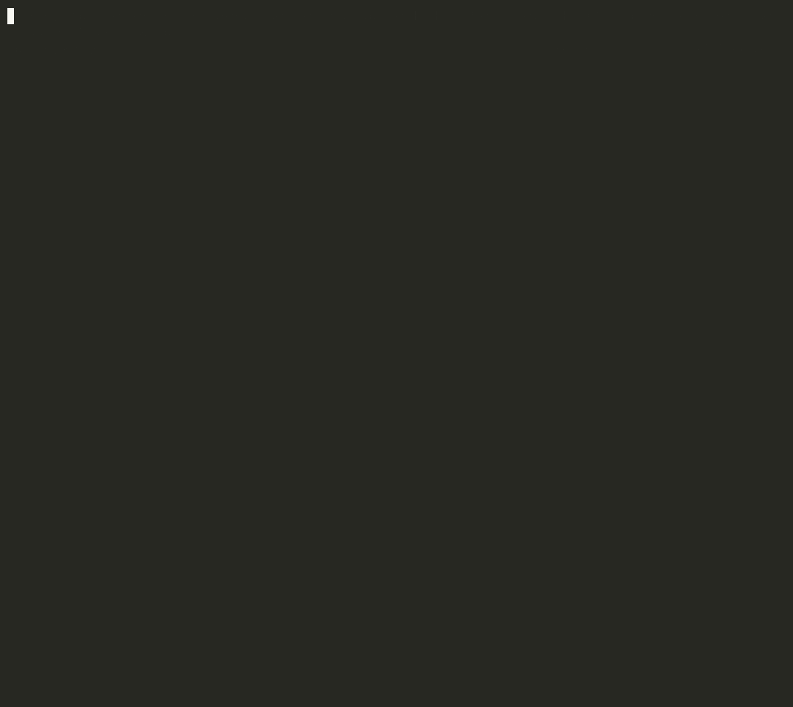

<div align="center">

# Constrained GraphRAG


**Finding the right ~2000 characters out of 28,246 chunks of the vLLM codebase via BM25.**



*The full pipeline — retrieve → graph expand → prompt → answer — on a real question, run twice: once cold, once served from `cache/cache.py`. Same answer, **7.2x faster** the second time.*

📖 [**RUNNING.md**](./RUNNING.md) — full setup + command reference · 🐳 [**docker-setup.md**](./docker-setup.md) — Neo4j via Docker

</div>

---

## 🧩 What is this project?

Constrained GraphRAG combines lexical-first retrieval (BM25) with **schema-constrained knowledge graph extraction** over the **vLLM 0.10.1** codebase (~2,800 files, docs + Python source).

The core idea, as a flow: each chunk is run through **Qwen3-0.6B**, constrained by [**Outlines**](https://github.com/dottxt-ai/outlines) so its output always matches a fixed schema.
1. The LLM decides which entities relate and how, Outlines just guarantees that decision comes out structurally valid.
2. Extracted entities and relationships are loaded into **Neo4j** as a graph, connecting chunks through the entities they share.
3. BM25 search at query time, BM25 finds the chunks that lexically match.
4. Graph traversal: the graph is traversed outward from them to pull in related chunks that never shared a single term with the original match.

Mechanics of *how* the constraining actually works are in [Extraction](#-extraction--constrained-decoding) below.

**Why this over a naive lexical-only RAG** (the shape of a prior BM25-only project): plain lexical retrieval has no concept of "entity" at all, only term frequency — a chunk mentioning `"Acme Corp"` and a chunk mentioning `"Acme Corporation"` share almost no tokens, and no amount of BM25 tuning can ever connect them, because the retriever has nothing to connect *with*. GraphRAG's answer is entity resolution: once both surface forms are merged into one canonical graph node at load time, *every* chunk mentioning either form becomes reachable from *every other* chunk mentioning either form, through that shared node.

A corpus is chunked into focused, offset-tracked spans, indexed with BM25 over an identifier-aware tokenizer, and searchable from a CLI — no embeddings, no vector index, no LLM in the loop yet.

```
uv run python -m src search "enable lora" --k 5
```

```
1. data/raw/vllm-0.10.1/tests/lora/test_tokenizer_group.py [2141:2747] score=5.07
2. data/raw/vllm-0.10.1/tests/lora/test_llama_tp.py [8720:9022] score=4.78
3. data/raw/vllm-0.10.1/vllm/transformers_utils/tokenizer_group.py [691:1287] score=4.74
```

---

## 🏗 Architecture

**Offline — building the graph** (`pipeline/index_pipeline.py`):



**Online — answering a query** (`pipeline/query_pipeline.py`):



---

## 🔄 Workflow

 The two diagrams above show data flowing between modules, this is the actual division of labor behind that flow, offline and online pieces both:

**The corpus is chunked (`chunking/`) → each chunk runs through `extractor.py`, where the LM creates entity-relationships *within* that one chunk → `loader.py`'s `MERGE` incidentally connects *across* chunks by reusing shared entity names → *(at query time)* BM25 (`retrieval/lexical/`) finds lexically-matching seed chunks → `traversal.py`'s `MATCH` *reads* the already-existing connections, expanding outward from those seeds to pull in chunks BM25 never lexically matched.**


---

## 🔗 Built On

Two earlier projects each contributed one core technique reused here, adapted rather than copied wholesale:

- **[RAG Against the Machine](https://github.com/DimYiannis/RAG-Against-the-Machine)** — the BM25 lexical retriever. `retrieval/lexical/tokenizer.py` and `indexer.py` are a direct port of that project's identifier-aware tokenizer and `bm25s`-backed index, adapted to this project's chunk metadata and package layout.
- **[call me maybe](https://github.com/DimYiannis/call_me_maybe)** — a function-calling engine that constrains a Qwen3-0.6B model's output token-by-token via a hand-rolled state machine over the model's vocabulary, so it can only ever emit valid, schema-conforming JSON. That project's core idea — grammar-constrained decoding making a 0.6B model reliable for structured generation — is exactly the mechanism `extraction/schema.py` is designed around here, this time via the [Outlines](https://github.com/dottxt-ai/outlines) library instead of a hand-rolled decoder.

---

## 🗂 Project Structure

Click a folder, then click a file inside it, to see what it does:

<details>
<summary>📁 <strong>src/</strong></summary>

<details>
<summary>📄 <code>__main__.py</code></summary>

The CLI entry point. Fire turns each method on `RagCLI` into a command — `index` chunks a corpus and builds the BM25 index, `search` queries it and prints ranked results.

</details>

<details>
<summary>📁 <strong>chunking/</strong></summary>

<details>
<summary>📄 <code>chunk_corpus.py</code></summary>

Walks a corpus directory, decides each file's chunking strategy and `source_type` ("code" vs "text") by extension, dispatches to the right chunker below.

</details>

<details>
<summary>📄 <code>ast_chunker.py</code></summary>

Chunks Python files by parsing the AST; each top-level function/class becomes its own chunk, decorators included. Falls back to line-window chunking if a file fails to parse.

</details>

<details>
<summary>📄 <code>plain_chunker.py</code></summary>

Chunks markdown by ATX headers (each `#`…`######` starts a new section), everything else by a fixed line-window fallback.

</details>

<details>
<summary>📄 <code>spans.py</code></summary>

The `Chunk` dataclass, and the shared span-splitting logic (cuts at a blank line, then any newline, then mid-line) every chunker funnels through to enforce `max_chunk_size`.

</details>

</details>

<details>
<summary>📁 <strong>retrieval/</strong></summary>

<details>
<summary>📄 <code>lexical/tokenizer.py</code></summary>

Turns text into BM25 search terms: lowercases, and splits identifiers into both whole and subtoken forms (`enable_lora` → `enable_lora`, `enable`, `lora`) so a query can match either way.

</details>

<details>
<summary>📄 <code>lexical/indexer.py</code></summary>

Builds/saves/loads the BM25 index (backed by `bm25s`), and `search()` — turns a query into ranked, tie-broken chunk results.

</details>

<details>
<summary>📄 <code>semantic/embeddings.py</code></summary>

Dense retrieval: embeds every chunk with `sentence-transformers` (`all-MiniLM-L6-v2`) into an L2-normalized matrix, persisted alongside the BM25 index. `semantic_top_k()` ranks by cosine similarity — a plain dot product, since normalized vectors make that equivalent to cosine similarity without recomputing norms per query.

</details>

<details>
<summary>📄 <code>fusion.py</code></summary>

Reciprocal Rank Fusion of a lexical ranking and a semantic ranking: `fuse()` scores each chunk by `Σ 1/(c + rank)` across both rankings — rank-based, not score-based, since BM25 scores and cosine similarities live on completely different scales and directly combining them would let one silently dominate. `hybrid_top_k()` wraps `lexical.search()` + `semantic_top_k()` + `fuse()` into one call, pulling a wider candidate pool (`FUSION_CANDIDATES`, default 100) from each retriever before fusing down to the final `k` — otherwise a chunk ranked low by one retriever but high by the other would never get the chance to surface.

</details>

</details>

<details>
<summary>📁 <strong>extraction/</strong></summary>

`schema.py`, `extractor.py`, `prompts/code_prompt.py` / `text_prompt.py` — the grammar, the constrained generator, and the two extraction prompts. Covered in depth in [Extraction & Constrained Decoding](#-extraction--constrained-decoding).

</details>

<details>
<summary>📁 <strong>graph/</strong></summary>

<details>
<summary>📄 <code>neo4j_client.py</code></summary>

Connection handling: builds a driver from `NEO4J_URI`/`NEO4J_USER`/`NEO4J_PASSWORD` (env vars, never hardcoded), verifies it can actually reach the database, a thin wrapper for running a Cypher query.

</details>

<details>
<summary>📄 <code>loader.py</code></summary>

Writes one chunk's `ExtractionResult` into Neo4j: the `Chunk` node, each entity, `MENTIONED_IN` edges linking entities back to their chunk, and the extracted relationship edges. The entity-merge logic (the actual entity-resolution mechanism) is covered in [Entity Resolution](#-entity-resolution).

</details>

<details>
<summary>📄 <code>traversal.py</code></summary>

Takes a retriever's top-k results as seed chunks (lexical, semantic, or hybrid — this function doesn't care which), walks 1-2 hops outward through the graph from the entities mentioned in them, returns the *other* chunks reachable that way — chunks the original retrieval pass never found at all.

</details>

</details>

<details>
<summary>📁 <strong>pipeline/</strong></summary>

<details>
<summary>📄 <code>index_pipeline.py</code></summary>

Offline orchestration: walks a corpus, chunks every file, runs each chunk through `extractor.py`, loads the result into Neo4j via `loader.py`. `limit` defaults to a small number rather than the full ~28,246-chunk corpus — extraction runs ~15-30s/chunk, so a full run is measured in days, not something to kick off by default.

</details>

<details>
<summary>📄 <code>query_pipeline.py</code></summary>

Runtime orchestration: BM25 search for seed chunks → `traversal.py`'s graph expansion outward from them → build the final prompt from both → generate an answer. Checks `cache/cache.py`'s persisted cache first and returns early on a hit, skipping retrieval/expansion/generation entirely; writes the result back to the cache on a miss.

</details>

</details>

<details>
<summary>📁 <strong>cache/</strong></summary>

`cache.py` — persistent, disk-backed exact-match cache keyed on `(query, k, hops, max_new_tokens)`; disk-backed since each CLI call is its own process. Its exact-match-only limitation is covered in [Challenges Faced](#-challenges-faced).

</details>

</details>

<details>
<summary>📁 <strong>evaluation/</strong></summary>

`evaluate.py` (recall@k across all retrieval modes) and `test_queries.json` (the 200-question ground truth) — methodology and numbers covered in [Results](#-results).

</details>

<details>
<summary>📁 <strong>tests/</strong></summary>

<details>
<summary>📄 <code>test_extraction_quality.py</code> / <code>test_cache.py</code></summary>

Real pytest tests. The first asserts the identifier regex (`schema.py`) holds against *live* model output, not just unit-tested Pydantic validation; the second covers `cache.py`'s round-trip (save/load, hit/miss, corrupt-file recovery).

</details>

<details>
<summary>📄 <code>check_chunks.py</code> / <code>check_extraction.py</code> / <code>check_pipeline.py</code></summary>

Standalone debug scripts (not pytest) for eyeballing one stage in isolation — chunking output, a single extraction call, or the query pipeline end-to-end — against real data, without running the whole CLI.

</details>

<details>
<summary>📄 <code>check_er.py</code></summary>

Verifies entity-resolution normalization actually merges cosmetic name variants into one graph node. Deliberately scoped and non-destructive: test data carries a marker prefix guaranteed never to collide with real corpus data, and cleanup only ever deletes nodes matching that prefix — never a blanket wipe (a blanket `MATCH (n) DETACH DELETE n` here once cost hours of re-extraction to recover from).

</details>

<details>
<summary>📄 <code>load_eval_subset.py</code></summary>

One-off, resumable script: extracts + loads into Neo4j only the chunks that overlap a `test_queries.json` ground-truth span (a few hundred, not the full ~28,246-chunk corpus) — enough to run a real `lexical+graph` evaluation without days of extraction. Skips chunks already present on re-run.

</details>

</details>

<details>
<summary>📁 <strong>data/</strong></summary>

<details>
<summary>📄 <code>raw/&lt;corpus-name&gt;/</code></summary>

Holds the corpus.

</details>

<details>
<summary>📄 <code>processed/</code></summary>

The persisted BM25 index (`bm25s`-backed) and the semantic embeddings matrix (`embeddings.npy`) — built once by `index` / the embeddings build script respectively, loaded by every `search`/`answer`/`evaluate` call after.

</details>

<details>
<summary>📄 <code>cache/</code></summary>

`cache.py`'s persisted query cache (see `src/cache/`) — survives across CLI invocations since each one is its own process.

</details>

</details>

<details>
<summary>📁 <strong>assets/</strong></summary>

<details>
<summary>📄 <code>eval_demo.gif</code> / <code>answer_cache_demo.gif</code></summary>

The two demo GIFs embedded at the top of this README — the lexical/semantic/hybrid recall@k comparison, and the full pipeline answering a real question twice (cold vs. cache hit). Each has a matching `.cast` file (the raw `asciinema` recording it was rendered from via `agg`).

</details>

<details>
<summary>📄 <code>record_answer_cache_demo.sh</code></summary>

The script the `answer_cache_demo.gif` recording actually runs: calls `answer` twice with the same query, times each with `date`/`bc`, prints the real elapsed seconds and speedup — makes the cache's effect visible on screen rather than relying on the GIF's own timing.

</details>

</details>

---

## 🧠 Extraction & Constrained Decoding

The extraction schema (`extraction/schema.py`) is a Pydantic model (`ExtractionResult`) handed directly to Outlines. Outlines compiles that schema into a **finite state machine**, and at every single token the model generates, masks every token that would leave a valid path through that FSM down to probability zero before sampling — a **mathematical guarantee**, not a "the model was told to behave" guarantee. That's what makes a 0.6B model viable here at all: the reliability gap that would normally require a frontier model is closed by making invalid output structurally unreachable, rather than by making the model smarter.

Two things worth being precise about scope-wise:

- This constrains *structure and type* (`node_type`/`relation` are enum-restricted fields, `name`/`subject`/`target` are regex-restricted to an identifier shape) — it does **not** constrain *which* real-world thing a name refers to. Two chunks extracting the same real entity under different names (`"Acme Corp"` vs `"Acme Corporation"`) is a separate, unsolved problem — see [Entity Resolution](#-entity-resolution) below.
- `CHUNK` and `MENTIONED_IN` are deliberately excluded from what the model is even allowed to emit (see `ExtractableNodeType`/`ExtractableRelationType` in `schema.py`) — `Chunk` nodes already exist before extraction runs, and `MENTIONED_IN` is structural (an entity extracted *from* a chunk is trivially mentioned in it), added automatically rather than spending the model's constrained generation budget on it.

---

## 🏷 Closed Taxonomy vs. Open Labeling

**Designing a closed relation-type taxonomy, instead of open-ended extraction.** The default approach in most GraphRAG tutorials — including [Microsoft's original GraphRAG implementation](https://microsoft.github.io/graphrag/index/default_dataflow/), whose extraction prompt asks for a free-text `relationship_description` rather than a fixed type — is to let the model freely choose relationship labels from context — `"calls"`, `"invokes"`, `"is called by"`, `"depends on"`. At small scale this looks harmless. At the scale needed for a usable knowledge graph, it becomes label proliferation: dozens of near-duplicate relation strings fragmenting what should be one queryable edge type, with no clean way back.

### Fixes:
- Clustering/Deduplication process could be iplemented but it can be lossy and adds a whole extra pipeline stage.

- The alternative, restricting up front, risks losing genuinely useful nuance if the schema is too coarse. Resolved by defining a small, fixed enum of relation types (`CALLS`, `IMPORTS`, `INHERITS_FROM`, `RELATES_TO`, etc. — see `RelationType` in `schema.py`) and enforcing them at generation time via the same FSM-based constrained decoding used throughout this project: the model is only ever able to emit a token sequence resolving to one of the valid types, trading some expressiveness for guaranteed schema consistency. The right tradeoff for a system meant to support reliable multi-hop traversal, less so for open-ended exploratory tagging.

Each type earns its place by doing one specific, well-defined job — except one, deliberately:

- **`CALLS`** — one function invokes another. Applies only when the code shows an actual call, not "these two functions seem related."
- **`IMPORTS`** — a module imports another module. A literal import statement, not a vague dependency.
- **`INHERITS_FROM`** — a class inherits from another class. Structural, unambiguous — nothing else can mean this.
- **`DEFINED_IN`** — a function or class is defined within a module. Containment, not association.
- **`REFERENCES`** — the deliberate cross-modal link: a markdown/doc chunk mentioning a specific function or class by name, connecting documentation to code. A specific, well-defined relationship with a clear rule for when it applies.
- **`RELATES_TO`** — "these two entities are related somehow, but not in a way any of the specific types capture." Every other type above is precise *because* this one exists to absorb what doesn't fit — without it, ambiguous cases would pressure the specific types to loosen their own definitions instead.

*What I'd do differently:* design the enum with an explicit versioning/extension process from the start, rather than treating it as fixed. A closed schema solves label proliferation, but a genuinely new relationship type the initial design didn't anticipate has nowhere to go except a catch-all like `RELATES_TO` — which just relocates the fuzziness instead of removing it. 
- Better: periodically review catch-all usage as a signal for when the enum itself needs a deliberate, reviewed addition — schema evolution as a governed process, not a binary choice between fully open and fully frozen.

---

## 🪪 Entity Resolution

**The closed taxonomy above solves *type* consistency. It says nothing about *identity*.** `NodeType`/`RelationType` only guarantee that two independent extractions are *allowed* to agree a thing is a `Function` or a `Class` — they don't guarantee two mentions of the same real-world thing end up as the same graph node.

**Our problem, concretely:** `graph/loader.py` currently merges entities by exact string match — `MERGE` on `(label, name)`. Two chunks both extracting an entity named `"TokenizerGroup"` correctly collapse into one shared node, with `MENTIONED_IN` edges from both chunks pointing at it. That's the mechanism that makes cross-chunk graph connections happen at all. But exact match does nothing for `"Acme Corp"` vs `"Acme Corporation"` — two mentions of the same real entity, spelled differently, silently become two separate nodes. No error, no warning — just quietly fragmented graph structure, each half missing edges the other has.

[Aakash's writeup on entity resolution](https://www.aakashx.com/blog/knowledge-architecture-ontologies-entity-resolution-graphs/#5-18-graphrag) deterministic matching (exact ID/key equality) vs. probabilistic/fuzzy matching (similarity + confidence scoring) -> "probabilistic inference should not silently become authoritative master data." Avoid automatical merge of probable similar entities (uncertain inference). If merge is wrong the mistake is silent and harder to catch than a duplicate.

---

## 📊 Results



*Live recall@k across all three retrieval arms — **lexical** (BM25), **semantic** (`sentence-transformers` dense embeddings), and **hybrid** (Reciprocal Rank Fusion of both) — each with an optional graph-expansion pass.*

Recall@k on `evaluation/test_queries.json` (200 questions, reused from a sibling project's dataset over the same vLLM 0.10.1 corpus — see `evaluation/evaluate.py`). A hit requires the retrieved chunk to cover at least 50% of the ground-truth answer span. All three retrieval modes ran against the same corpus, same questions, same graph.

| k | lexical | +graph | semantic | +graph | hybrid | +graph |
|---|---------|--------|----------|--------|--------|--------|
| 3 | 0.665 | 0.710 | 0.355 | 0.440 | 0.565 | 0.620 |
| 5 | 0.705 | 0.745 | 0.400 | 0.490 | 0.650 | 0.700 |
| 10 | 0.785 | 0.815 | 0.515 | 0.610 | 0.725 | 0.770 |

Not the naive "hybrid wins" story:

- **Lexical is the strongest single retriever here, by a clear margin.** This corpus is a codebase — ground truth hinges on exact identifiers and function names, exactly what BM25's term matching is built for.
- **Semantic alone is meaningfully weaker** (0.355-0.515). It finds *conceptually* related content rather than exact-name matches — for the query `"enable lora"`, semantic surfaces `docs/features/lora.md` and LoRA-handling code in `worker/model_runner.py`, while lexical surfaces `tests/lora/test_tokenizer_group.py` and `transformers_utils/tokenizer_group.py` — genuinely different, both reasonable, but this eval's precise identifier-anchored ground truth rewards lexical's style more.
- **Hybrid lands between the two, closer to lexical than to semantic — and never beats lexical alone.** RRF fusion pulls lexical's strong ranking down by averaging in semantic's weaker one; on a corpus this identifier-precise, fusing in a weaker retriever costs more than it adds.
- **Graph expansion helps every single mode, at every k, with no exceptions** — the one fully consistent result in the whole table, and the strongest evidence here that the graph mechanism itself is sound, independent of which retriever finds the seed chunks.

<details>
<summary>Per-split breakdown (docs vs code)</summary>

**docs (n=101)**

| k | lexical | +graph | semantic | +graph | hybrid | +graph |
|---|---------|--------|----------|--------|--------|--------|
| 3 | 0.772 | 0.812 | 0.455 | 0.554 | 0.594 | 0.663 |
| 5 | 0.792 | 0.832 | 0.495 | 0.594 | 0.673 | 0.723 |
| 10 | 0.851 | 0.881 | 0.564 | 0.673 | 0.743 | 0.792 |

**code (n=99)**

| k | lexical | +graph | semantic | +graph | hybrid | +graph |
|---|---------|--------|----------|--------|--------|--------|
| 3 | 0.556 | 0.606 | 0.253 | 0.323 | 0.535 | 0.576 |
| 5 | 0.616 | 0.657 | 0.303 | 0.384 | 0.626 | 0.677 |
| 10 | 0.717 | 0.747 | 0.465 | 0.545 | 0.707 | 0.747 |

Semantic's gap vs. lexical is proportionally wider on code than docs (k=3: code's semantic score is under half of lexical's, docs' is closer to 60%) — semantic similarity has less to latch onto in code identifiers (`kv_cache_coordinator`, `compressed_tensors`) than in prose, which has more natural-language structure the embedding model can actually use.

</details>

---

## ⚠️ Limitations

- **The graph only covers 303 of the corpus's 28,246 chunks (299 loaded — 8 permanently failed truncation, see Challenges Faced).** Extraction runs one chunk at a time through Qwen3-0.6B (~60-90s/chunk observed). A full-corpus run is weeks of compute, not something to do by default. The graph was instead ingested only over the chunks that `evaluation/test_queries.json`'s ground-truth answers actually live in, enough to run a real evaluation but not a full production-scale graph. Lexical search, by contrast, runs over the entire corpus — see [Results](#-results) for how that scoping affects the comparison.

---

## 🧗 Challenges Faced

**A 0.6B model doesn't automatically produce clean, real identifiers just because the JSON around them is valid.** Early testing surfaced two distinct failure modes, fixed at two different layers:

- **Prompt-level fix:** the model would sometimes name an entity after the schema's own type vocabulary — literally `"Function"`, `"Class"`, `"Module"` as an entity's *name*, copying the words right next to where `name` was being defined in the prompt. Fixed by extending both extraction prompts (`code_prompt.py`/`text_prompt.py`) with an explicit worked example and a direct instruction: the name is a real identifier from the text, never the literal type-vocabulary words.
- **Schema-level fix:** relationship `subject`/`target` values kept showing up as entire import statements or sentences instead of clean identifiers — structurally valid per the schema at the time (a plain unconstrained `str`), but semantically useless. Prompt wording alone only partially fixed this. The real fix was adding a regex constraint (`Field(pattern=r"^[A-Za-z_][A-Za-z0-9_.]*$")`) directly to `schema.py`'s `name`/`subject`/`target` fields — Outlines compiles that pattern into the same FSM that already enforces `node_type`/`relation`, so a full import statement became *structurally unreachable* to generate, not just discouraged by prompt text.

**One edge case the regex fix doesn't close:** it constrains *shape*, not *truth*. The model can still fabricate a string that looks identifier-shaped but isn't a real symbol anywhere in the source — observed case: `from vllm.utils import LRUCache` got mashed into `"from_vllm.utils.lrucache"` as a relationship target, which satisfies the regex (only letters/underscores/dots) while being a fabrication. A regex can only ever constrain what a string *looks like*; verifying it's a *real* symbol from the actual chunk would need a fundamentally different mechanism.

**The query cache only ever matches identically.** `cache/cache.py` keys on the literal `(query, k, hops, max_new_tokens)` tuple — `"enable lora"` and `"Enable LoRA"` are two totally different cache entries, even though a person reads them as the same question. A cache that catches near-paraphrases needs a **semantic cache** instead — embed the query, compare similarity against past queries.

**A small fraction of chunks never finish extraction, even with a bumped token budget.** Loading the eval ground-truth subset (303 chunks), 8 permanently failed with `EOF while parsing a string` — the model was still mid-entity when it hit `max_new_tokens` (raised to 768 for this run, up from the default 512), so Outlines' FSM produced valid-so-far-but-incomplete JSON rather than a parseable `ExtractionResult`. Almost always entity-dense code files (attention kernels, quantization backends) generating more entities/relationships than the budget anticipated. Accepted as a known error rate rather than chased further — the fix (a much larger budget, or splitting the chunk itself) trades extraction cost for a rare failure mode that doesn't materially affect graph coverage at this scale.

   ---

## 📎 Resources

- [graphrag.com](https://graphrag.com/) — general GraphRAG background.
- [Microsoft GraphRAG — Indexing Dataflow](https://microsoft.github.io/graphrag/index/default_dataflow/) — the open-ended entity/relationship extraction approach this project's closed taxonomy deliberately departs from.
- [The GraphRAG Manifesto — Neo4j](https://neo4j.com/blog/genai/graphrag-manifesto/) — why graph-augmented retrieval beats naive RAG.
- [Cypher `MERGE` clause](https://neo4j.com/docs/cypher-manual/current/clauses/merge/) — idempotent node/relationship creation, used throughout `graph/loader.py`.
- [Hugging Face — Prompting](https://huggingface.co/docs/transformers/main/en/tasks/prompting) — the grounding-prompt pattern `query_pipeline.py`'s `PROMPT_TEMPLATE` follows.
- [Knowledge Graphs for RAG — DeepLearning.AI](https://www.deeplearning.ai/courses/knowledge-graphs-rag) — course on building/querying knowledge graphs for RAG.
- Robertson & Zaramba, *The Probabilistic Relevance Framework: BM25 and Beyond* — BM25 scoring, `k1`/`b`.
- [bm25s documentation](https://github.com/xhluca/bm25s) — the BM25 library used here.
- [Python `ast` module docs](https://docs.python.org/3/library/ast.html) — used for structure-aware Python chunking.
- [uv docs](https://docs.astral.sh/uv/) — dependency/project management.
- [How to Build Type-Safe, Schema-Constrained, and Function-Driven LLM Pipelines Using Outlines and Pydantic](https://www.marktechpost.com/2026/03/14/how-to-build-type-safe-schema-constrained-and-function-driven-llm-pipelines-using-outlines-and-pydantic/) — Outlines + Pydantic structured generation.
- [Structured Output (JSON) — LoRAX Docs](https://loraexchange.ai/guides/structured_output/) — constrained JSON generation background.
- [Outlines — structured JSON/regex/Pydantic LLM generation](https://hermes-agent.nousresearch.com/docs/user-guide/skills/optional/mlops/mlops-inference-outlines) — how Outlines' FSM-based constraining works.
- [Outlines Model Initialization](https://dottxt-ai.github.io/outlines/main/features/models/transformers/?utm_source=chatgpt.com)
- [Loading models from HF](https://huggingface.co/docs/transformers/en/models?utm_source=chatgpt.com)
- [Tokenizer and Auto classes from HF](https://huggingface.co/docs/transformers/model_doc/auto?utm_source=chatgpt.com)
- [Outlines Generator](https://dottxt-ai.github.io/outlines/main/features/core/generator/?utm_source=chatgpt.com)
- [Knowledge Architecture: Ontologies, Entity Resolution, Graphs](https://www.aakashx.com/blog/knowledge-architecture-ontologies-entity-resolution-graphs/#5-18-graphrag)  frames GraphRAG as an architectural pattern worth reaching for only when relationships materially affect the answer ("the graph provides scope, vectors provide relevance").
- [SentenceTransformers — main docs](https://sbert.net/) — the library itself: quickstart, `SentenceTransformer(model_name)`, `.encode()`.
- [Pretrained Models](https://sbert.net/docs/sentence_transformer/pretrained_models.html) — model comparison table, includes `all-MiniLM-L6-v2` (the one used in `retrieval/semantic/embeddings.py` — fast, 384-dim, 256-token cap).
- [Semantic Search](https://sbert.net/examples/sentence_transformer/applications/semantic-search/README.html) — the actual use case here: embed a corpus, embed a query, rank by cosine similarity — same pattern `semantic_top_k()` implements.
- [`.encode()` API reference](https://sbert.net/docs/package_reference/sentence_transformer/SentenceTransformer.html#sentence_transformers.SentenceTransformer.encode) — the exact params in use (`batch_size`, `convert_to_numpy`, `normalize_embeddings`, `show_progress_bar`).
- Cormack, Clarke & Buettcher, [*Reciprocal Rank Fusion outperforms Condorcet and individual Rank Learning Methods*](https://plg.uwaterloo.ca/~gvcormac/cormacksigir09-rrf.pdf) (SIGIR 2009) — the original RRF paper; `RRF_C = 60` in `retrieval/fusion.py` is this paper's own tuned constant, not an arbitrary choice.
- [Reciprocal Rank Fusion — Elastic docs](https://www.elastic.co/docs/reference/elasticsearch/rest-apis/reciprocal-rank-fusion) — a more approachable walkthrough of the same `1/(c + rank)` formula, with worked examples.
